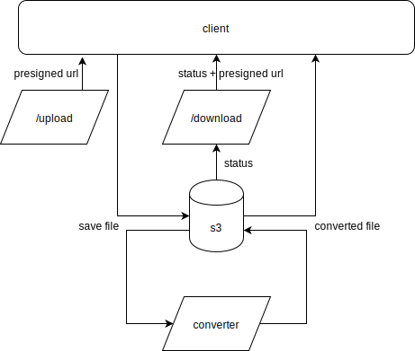

# Serverless Stellaris save file converter

Web-based, serverless application to parse Stellaris save files and output in JSON format.

The parser is available at [pypdx-clausewitz](https://github.com/PyPDX/clausewitz).

The frontend is available at [stellaris-save-vid](https://github.com/PyPDX/stellaris-save-vid).

## Architecture



## Dev

### Prerequisites

This application is developed based on AWS's SAM model.
If you want to deploy this application yourself,
please familiarize yourself with AWS and related concepts.

[`aws-sam-cli`](https://docs.aws.amazon.com/serverless-application-model/latest/developerguide/serverless-sam-cli-install.html) needs to be installed.
If you don't want to install it into system python,
it is ok to install it within a virtual environment.

[Docker](https://docs.docker.com/install/) needs to be installed.

### Deploy (first time):

```bash
make deploy_guided
```

### Deploy:

```bash
make deploy
```
